= Msfs 2024 Livery Tools
:doctype: article
:description: Project Documentation for Msfs2024LiveryTools
:keywords: kotlin, Microsoft Flight Simulator 2024, texture conversion
:icons: font
:toc: macro
:toc-title: Contents
:toclevels: 3
:idseparator: -

toc::[]

== Status

image:https://github.com/sknull/MSFS2024LiveryTools/actions/workflows/github-ci.yml/badge.svg[MSFS 2024 Livery Tools,link=https://github.com/sknull/MSFS2024LiveryTools/actions/workflows/github-ci.yml]
image:https://github.com/sknull/MSFS2024LiveryTools/actions/workflows/github-ci-release.yml/badge.svg[MSFS 2024 Livery Tools Release,link=https://github.com/sknull/MSFS2024LiveryTools/actions/workflows/github-ci-release.yml]

Version 1.0.1

Github page: https://github.com/sknull/MSFS2024LiveryTools

Releases page: https://github.com/sknull/MSFS2024LiveryTools/releases

Flightsim.to page: https://flightsim.to/addon/105878/msfs-2024-livery-tools

== About

=== First Things First

Thanks to https://flightsim.to/profile/Flak[FLAK] who has created the https://flightsim.to/file/89937/image-to-ktx2-texture-script-for-msfs-2024-livery-creation-imagetomsfsktx2[MSFS2024 Image Tool]
All knowledge on converting images to the proper KTX2 format for Microsoft Flight Simulator 2024 was taken from his batch script.

[WARNING]
====
For now there are no safeguards. The project is in early alpha state but can already be used.
If you convert textures after having set up your project target files will eventually be overwritten.
You are responsible to make backups of your data to avoid loosing your hard work!
====

=== Motivation

ImageToMSFSKTX2 is a tool to convert png files to the KTX2 format the modern MSFS 2024 liveries use. It is a large windows batch script which works by copying your pngs to convert into a certain folder structure then executing the batch and afterward grabbing the final texture files from some other folder and copy them to the final target directory.
While all this works perfect there are some caveats with this:

- A lot of manual work
- Lack of support for dds files which are still be used by MSFS 2020 style liveries
- Not designed to work with a lot of projects as you have to take care on what to copy where
- hence error-prone workflow

To overcome all this the idea came up to create a tool which is more project centric and has some graphical user interface which is nice to use.
Unfortunately there was nothing similar so - the old story - I did it my self.
The result is what you have now here.
Also I used this to actually learn Kotlin Multi Platform, so this is my first attempt with this new technology.

== Preliminaries

To use this tool you need these tools (which you might have already from working with ImageToMSFSKTX2):

. https://github.com/HughesMDflyer4/MSFSLayoutGenerator[MSFS Layout Generator] Probably you already have that for usage with the image tool. This is used to rewrite the layout.json file after converting the textures.
. MSFS 2024 SDK. You can download and install that within the sims developer mode. Probably you already have that also for usage with the image tool. This is needed to convert from png to KTX2 format (while the NVIDIA tool can do also that but the textures will not work in the sim and show up pink - so we need to make use of SDK for this task)
. https://developer.nvidia.com/texture-tools-exporter[NVIDIA texture tools exporter] this is needed to convert the original ktx2 files to png for editing / painting. This is used for all other conversions and hence mandatory

== Documentation

This document in form of a PDF file can be found link:docs/README.pdf[here]

== Setup

=== Installation

==== Download Zip

==== Build Yourself

To compile the executable on your local machine just check out the project somewhere, cd to the root directory and issue:

[source]
----
./gradlew createDistributable
----

When the build finished successfully you find the final directory in directory

    <PROJECT_ROOT>/composeApp/build/compose/binaries/main/app/de.visualdigits.msfs2024liverytools

Copy the whole directory somewhere. The exe file is just a wrapper to a java main.
Of course you can rename the folder to whatever you like.
You may then just doubleclick on the exe file and you are good to go.

===== Preliminaries for this:

- Temurin 21 JDK
- Wix Toolset
- Launch4j

===== Scoop

I highly recommend to make use of a JDK manager I use scoop for this.

To install scoop on your machine just open a powershell and issue:

[source]
----
Set-ExecutionPolicy -ExecutionPolicy RemoteSigned -Scope CurrentUser
Invoke-RestMethod -Uri https://get.scoop.sh | Invoke-Expression
----

== Setup And Usage

=== The Project View

When you first open the app you will see the empty project view:

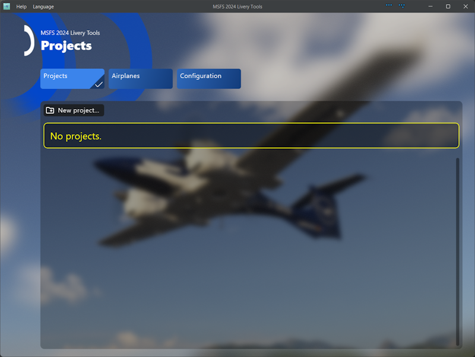

=== The Configuration View

To get started you need to set a few things up.

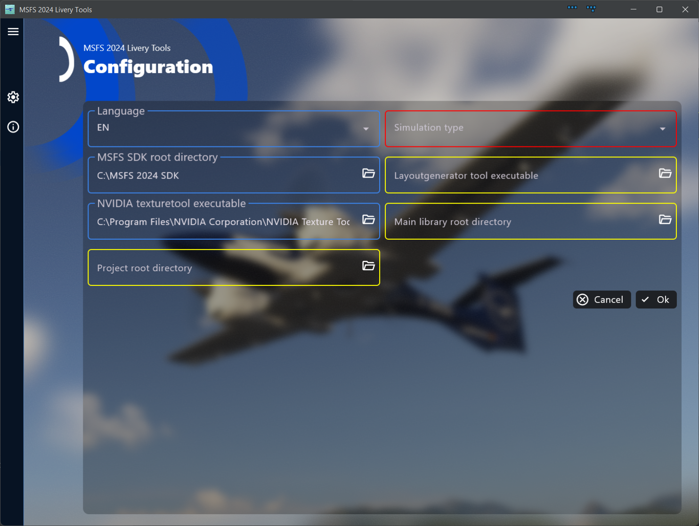

So click on "Configuration" and you will see the following form where you have
to set at least the type of store you are using (either Microsoft or Steam).
This is important for the latter conversion as the Microsoft SDK needs this information.

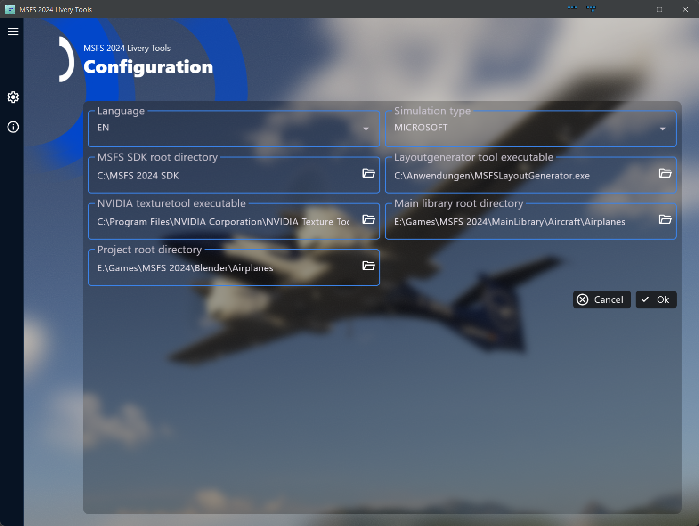

Additionally you should set the main library root directory (this is where you store your final addons) and the project root directory (this is where you store your livery projects for i.e. blender).

Optionally you may also set the path to the layoutgenerator tool. When you do the layout.json for the target project will then automatically recreate when you convert textures towards the Sim (either png to dds or png to ktx2).

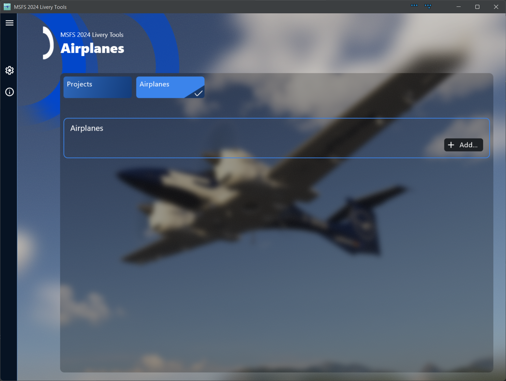

When you click "OK" the settings will be stored in a little json file:

    <USER_HOME>/.msfs2024liverytools/configuration.json

The setup will look like this:

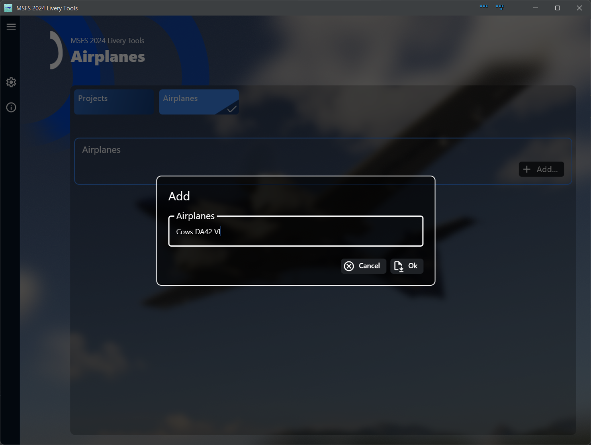

An idea for later is to be able to group projects by airplane so I decided this is not a free text field but a selection from a preset list.
Hence you have to configure for which airplanes you want to create liveries.
Unfortunately there is currently a problem with the way Kotlin Multi Platform works with scrollable elements. So for now we are stuck with a long list of projects which are only grouped visually. What already works is that when you change the name of an airplane this will be updated for all liveries for that airplane.

=== The Airplanes View

So click on "Airplane" and add some airplane name:

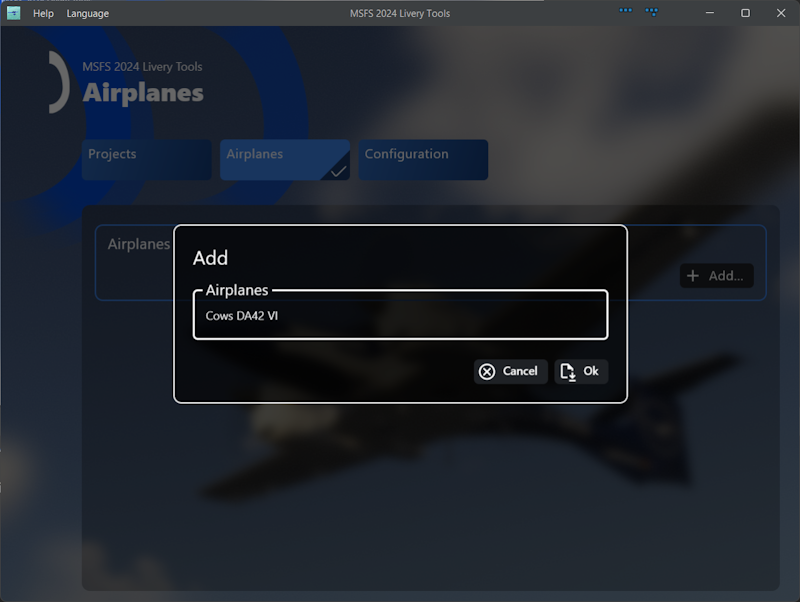

You will end up with something like this:
When an airplane is used by some project configuration the delete button will be disabled to preventing you from messing things up.

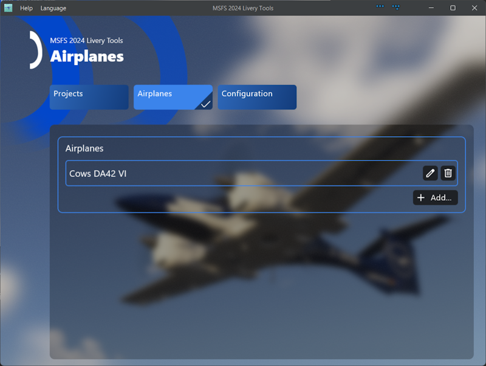

=== Project Configuration

After that preparation work we need to setup our first project:

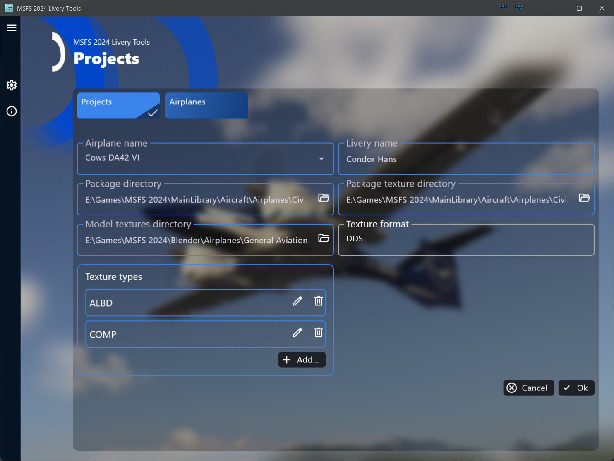

First select the airplane, then enter a useful name for the livery.
After that set the package directory (the directory which contains the layout.jon file)
Then the package texture sub directory - the respective filepicker will use the before set package directory as the start directory. I decided not to automate detection of the texture directory because a lot of people collect multiple flavors of a livery in one addon and hence it seems to be useful to do this manually.
Finally the texture types should be fine as is. If you are you are sure not not make use of metallic effects and use the original composite texture anyways you could delete the COMP entry.
NORM and DECAL are also supported but normally I do not fiddle with normals &#128512;.

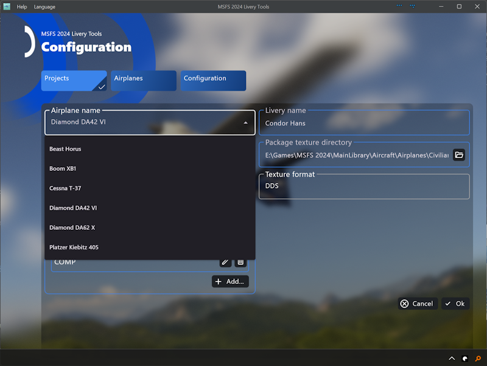

As you can see there is one field greyed out and cannot be altered - the texture format is calculated from which type of textures are found in the package texture directory.
So you do not have to take care on using the correct format.

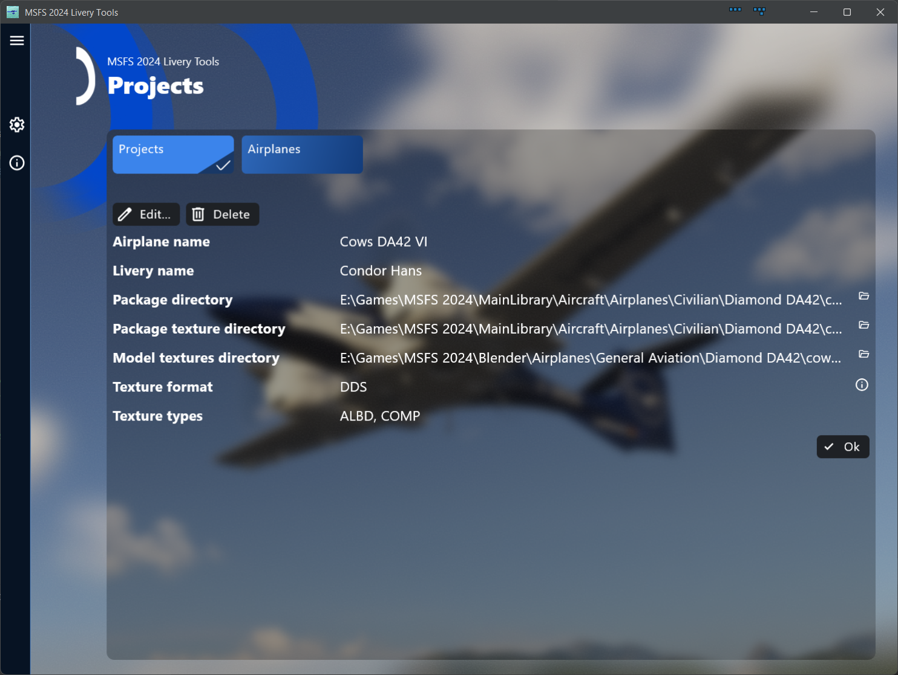

When you click "OK" you should see something like this - your first project configuration:

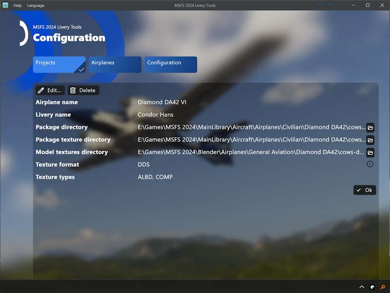

Click again on "OK" and you will see the project overview page. This is probably your main view and hence also the start view of the app.

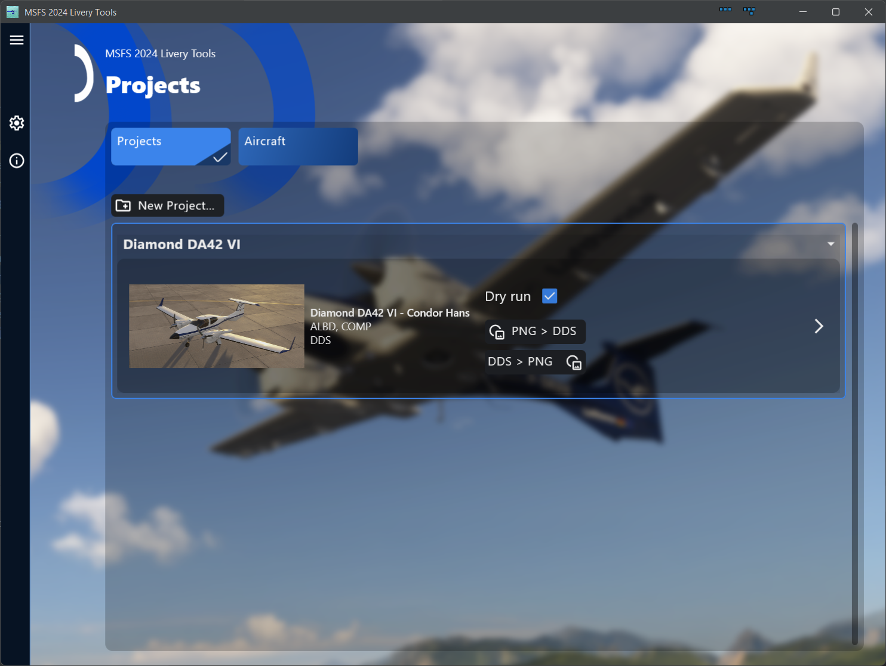

=== Running Conversions

As this project is in early alpha phase I decided to have checked the dry run flag by default to prevent accidental damage.

As the direction from sim to png will most times only be done once for a new project this is the second converion button the top most one will convert your png textures back to whatever the livery used originally.

When you click i.e. on "DDS > PNG" a new view will open and show the progress of conversions.
For a dry run it looks like this:

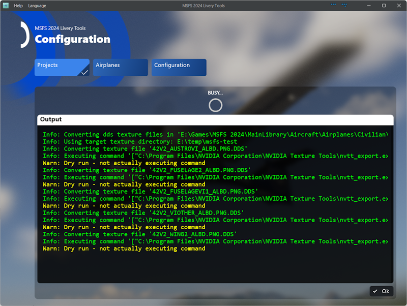

And for a real run like that:

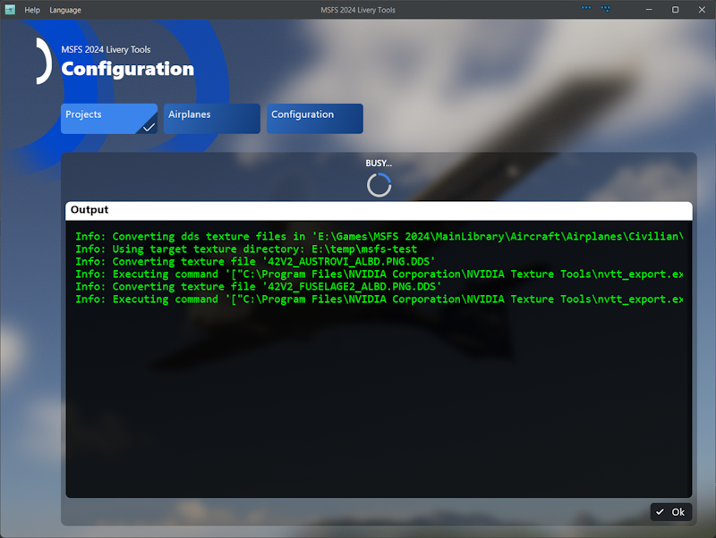

The tools also takes care on what needs to be converted. So it will select only files which are modified after the target file. hence a second run without modifying any texture looks like this:

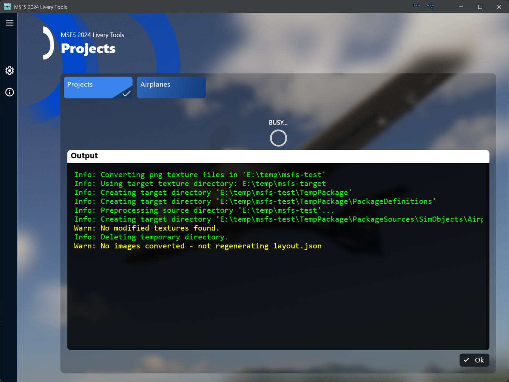

Finally a setup with dozens of livery projects can look like this.

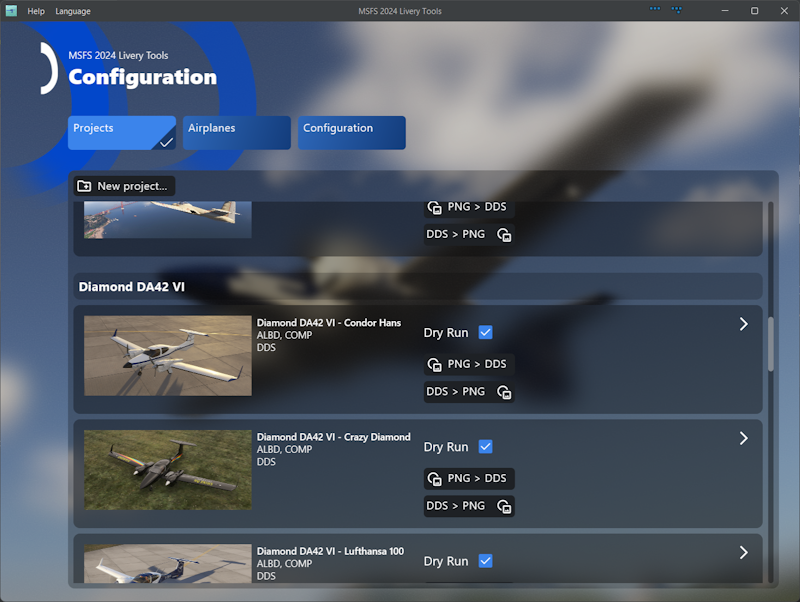

Voilá

== Under the hood

What happens under the hood is that the tool runs shell commands calling the needed tool from within the code.
In case of the MSFS SDK this also involves monitoring the running tasks list in order to grab the final textures not before the conversion process is finished. In this case you will notice that the Sim seems to start but this is probably a bug in the exporter tool of the SDK. The sim window will automatically be closed when the conversion is finished.
